# 🧠 Feature Extraction Power of 5 ImageNet CNNs on MNIST  
### *(Before & After Transfer Learning — PCA, t-SNE, UMAP)*

This repository compares **five ImageNet-pretrained CNNs** before and after transfer learning on MNIST, visualized using **PCA**, **t-SNE**, and **UMAP**.

---

## 📌 Models Evaluated
- **VGG16**
- **ResNet50**
- **InceptionV3**
- **MobileNetV2**
- **DenseNet121**

All models:
- Used `include_top=False`
- Extracted embeddings using global average pooling
- Fine-tuned only last block (2–3 epochs)

---

# 📊 1. PCA Visualizations  
### ⭐ Before vs After Transfer Learning

  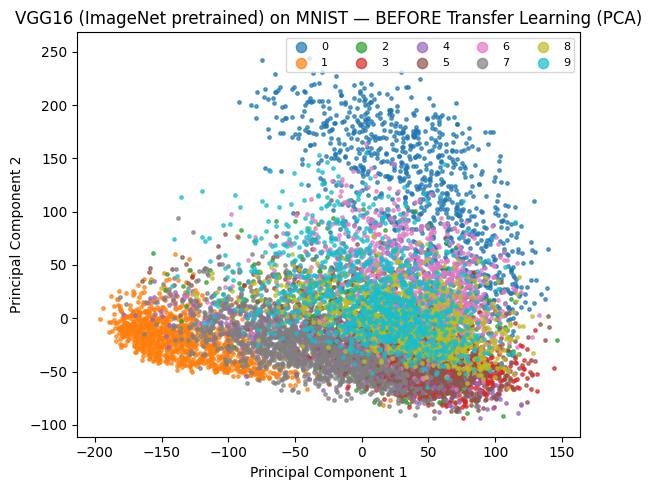 
  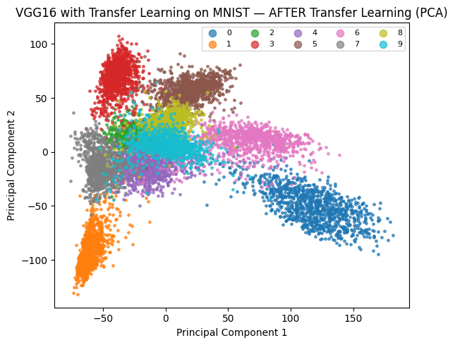
  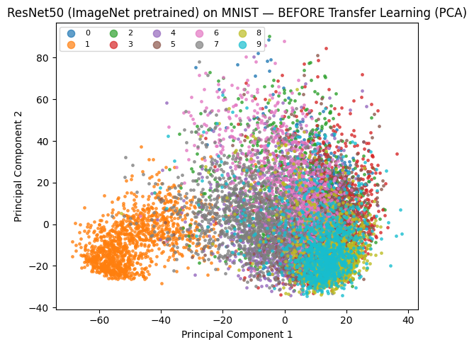

  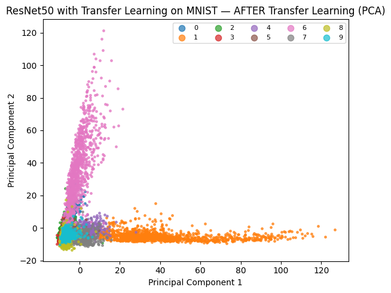
  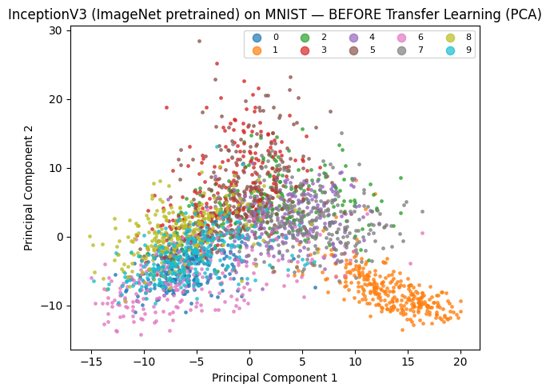
  

  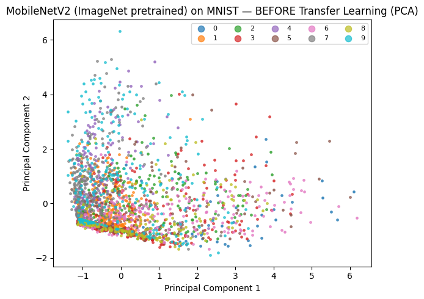
  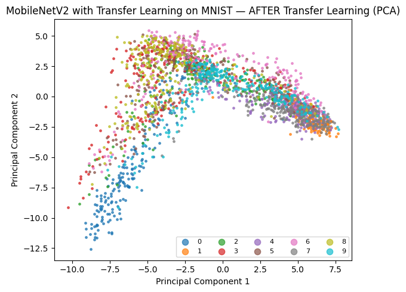
  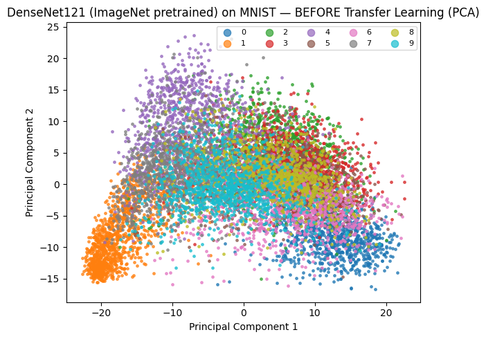

  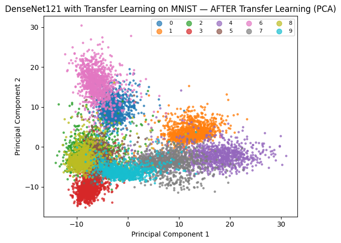

---

# 🎨 2. t-SNE Visualizations

  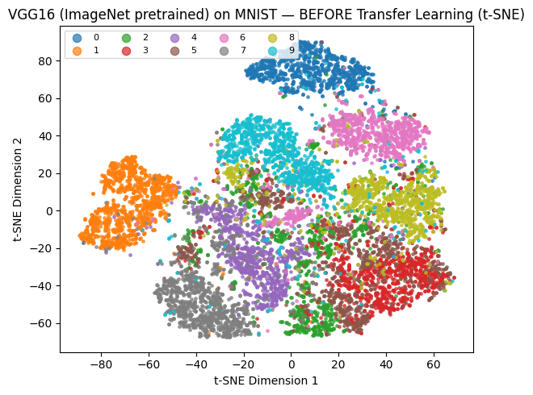 
  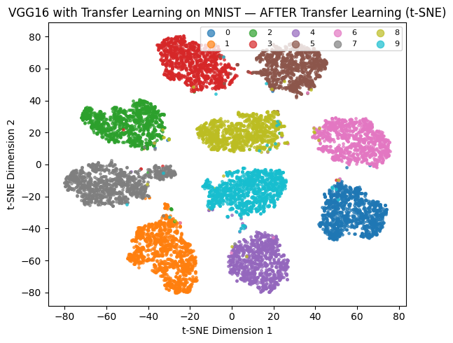
  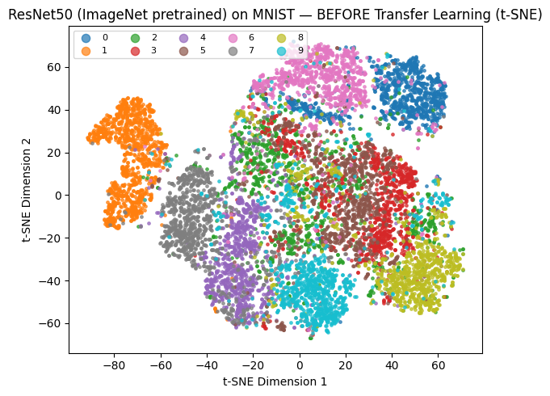

  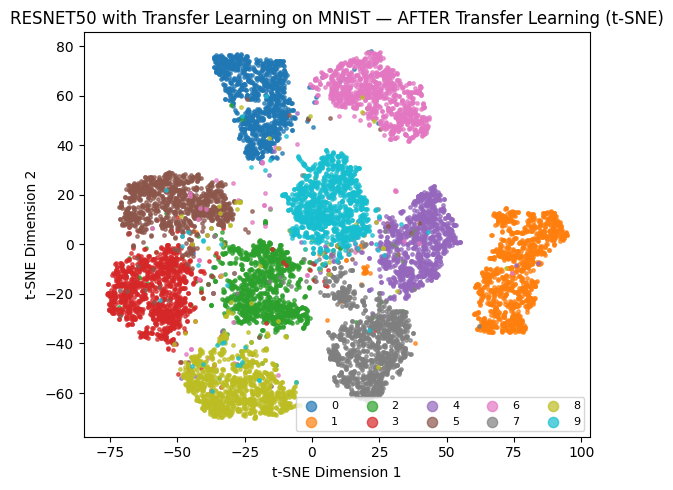
  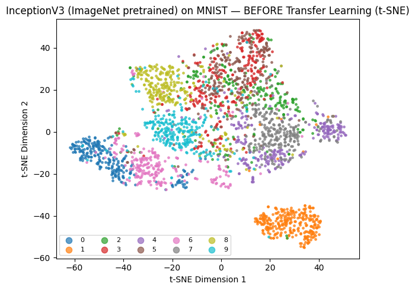
  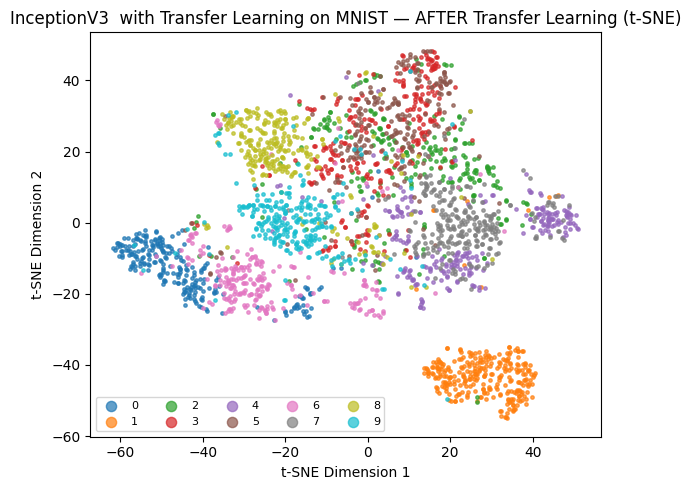

  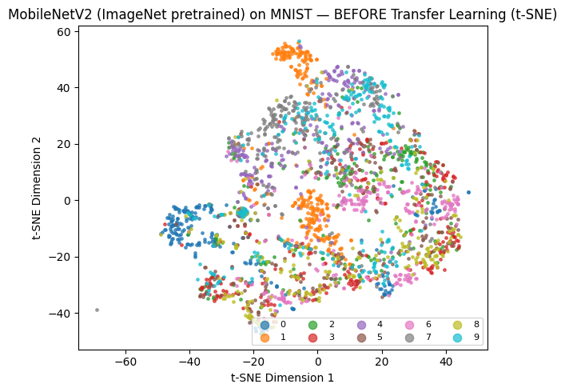
  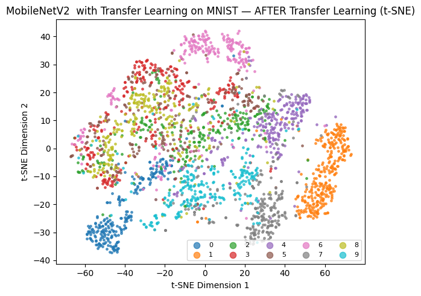
  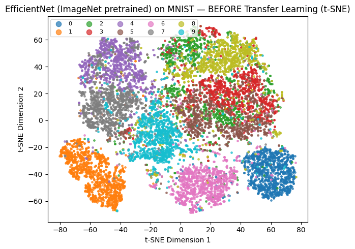

  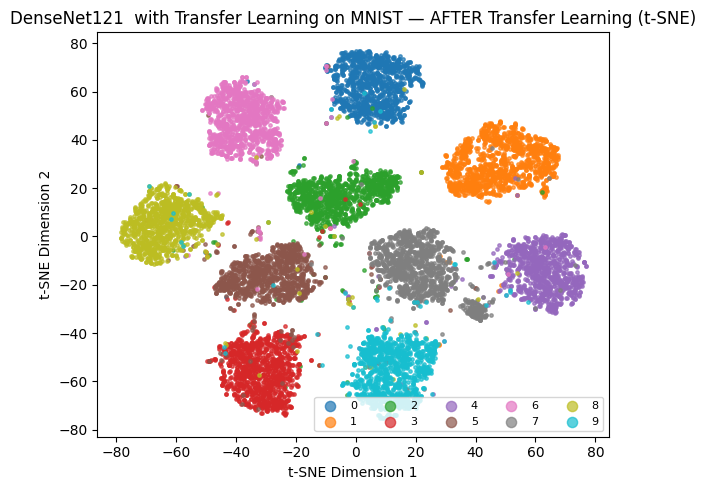

---

# 🌐 3. UMAP Visualizations

  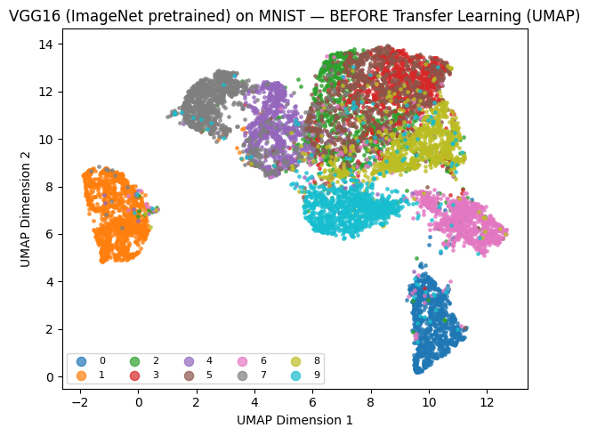 
  
  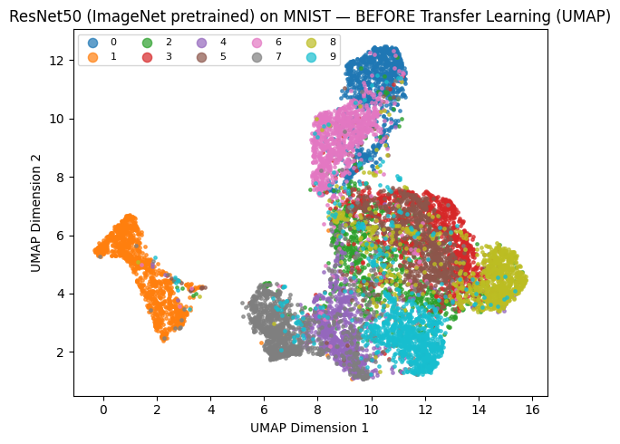

  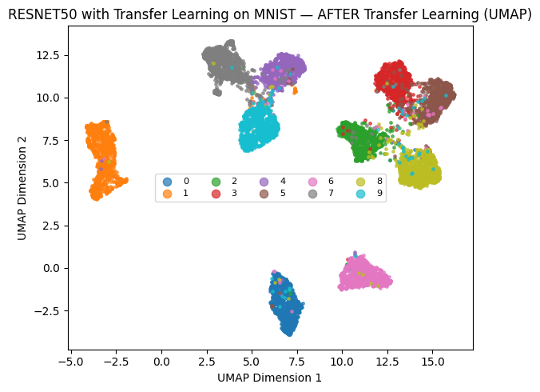
  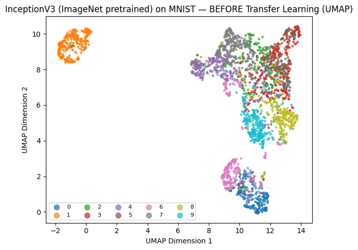
  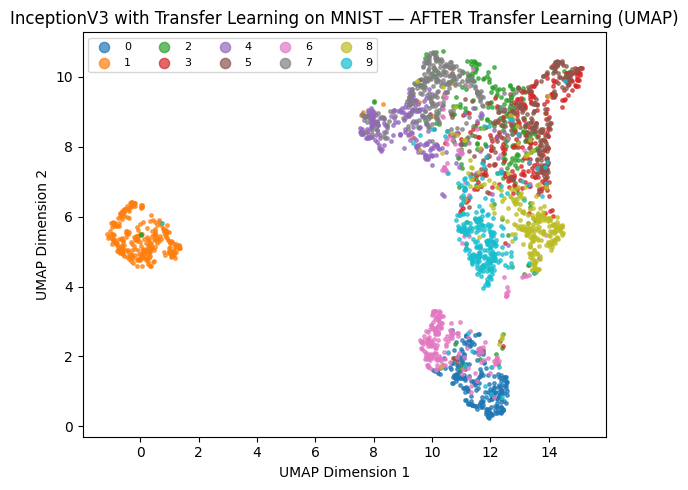

  
  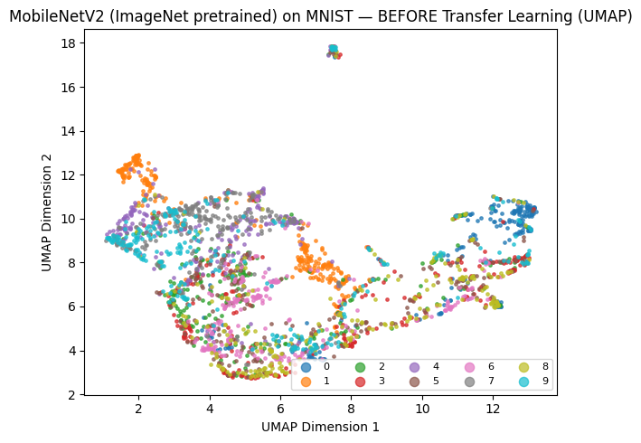
  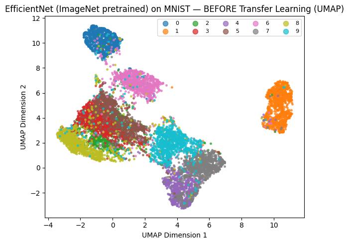

  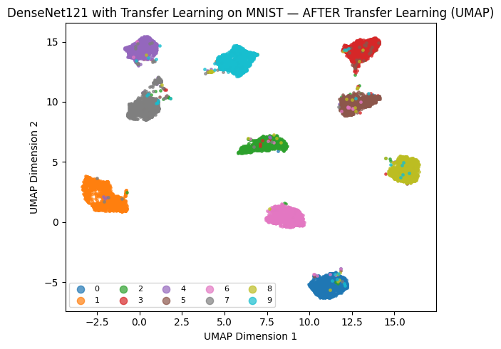

---

# 🔍 Key Observations  
- **VGG16** improves the most after transfer (huge cluster tightening).  
- **InceptionV3** already shows strong class separation without fine-tuning.  
- **ResNet50** and **DenseNet121** adapt very well with clean clusters.  
- **MobileNetV2** improves but remains less separable (lightweight trade-off).  
- **t-SNE & UMAP** show far clearer separation than PCA.  

---